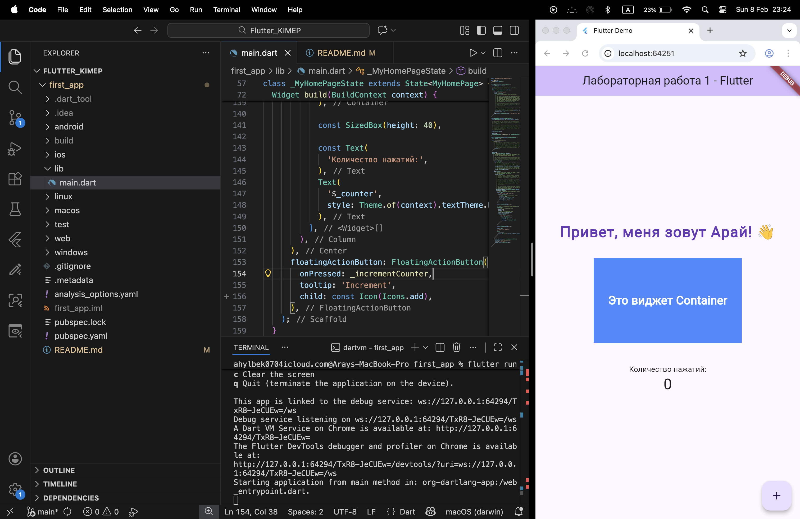

# Flutter Lab 1 - First Application

## Student: Aray
## Laboratory Work 1

### Completed Tasks:
✅ Set up Flutter & Dart SDK  
✅ Configured VS Code development environment  
✅ Created Flutter project (`first_app`)  
✅ Run application in Chrome emulator  
✅ Modified Text widget with custom message  
✅ Added Container widget with custom color and size  
✅ Customized text style (font size, weight, color)  
✅ Tested Hot Reload functionality  

### Screenshot:


### Code Highlights:
```dart
// Custom Text with styles
Text(
  'Привет, меня зовут Арай! 👋',
  style: TextStyle(
    fontSize: 28.0,
    fontWeight: FontWeight.bold,
    color: Colors.deepPurple,
  ),
),

// Added Container widget
Container(
  width: 280,
  height: 160,
  color: Colors.blueAccent,
  child: Center(child: Text('Это виджет Container')),
)